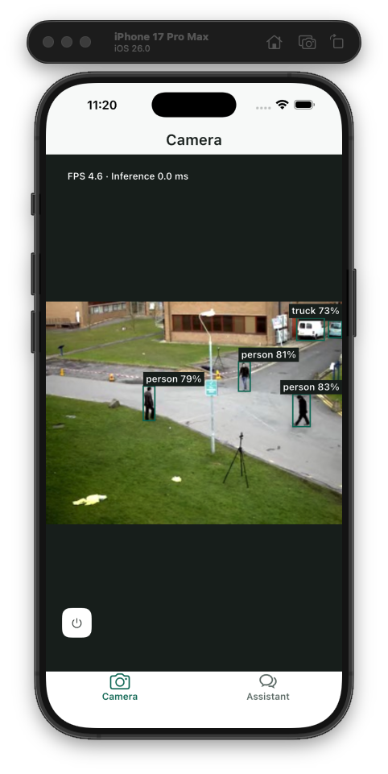
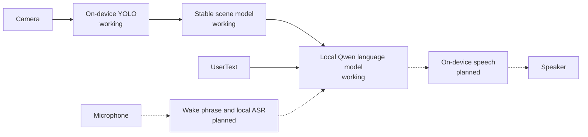

# POV Agent

POV Agent is a local-first Flutter experiment for an assistant that observes
through the camera, listens for a question, and answers using the current scene
as context.

> **Project status:** early prototype. Live and recorded camera input,
> on-device YOLO detection, stable scene tracking, and manual conversation with
> a local Qwen model work today. Automatic scene observation also works;
> speech recognition and spoken responses remain on the roadmap.

<p align="center">
  
</p>
<p align="center">
  <em>YOLO detection running in the iOS app through the recorded-video acceptance path.</em>
</p>

## Why

Most assistants only know what the user describes. POV Agent explores a more
direct interface: point the camera at a scene, ask a question aloud, and let the
agent respond without first translating the surroundings into a text prompt.

The MVP is designed to run on the device after its models have been installed.
Camera frames, audio, transcripts, and conversation history are not intended to
be persisted between launches.

## What works today

- Continuous object detection through the native camera surface.
- On-device `yolo26n` inference with bounding boxes, labels, confidence scores,
  FPS, and inference-time diagnostics.
- Front and rear camera switching, explicit camera enable/disable controls, and
  foreground lifecycle handling.
- Recoverable permission, model-loading, and inference failure states.
- Deterministic recorded-video input for testing the real iOS decoder and YOLO
  boundary without camera hardware.
- Session-scoped object tracking that suppresses isolated YOLO misses and emits
  only stable object appearance, movement, and disappearance.
- A manual Assistant conversation backed by Qwen3-0.6B Q4_K_M through the
  repository's own llama.cpp FFI bridge and persistent inference isolate.
- Verified model download, retry, offline cache reuse, streaming answers,
  cancellation, and removal of model reasoning from visible/session history.
- A foreground automatic observer that samples the latest stable scene every
  10 seconds by default, streams local Qwen comments, retains session-only
  context, and supports 10/30/60/120/300-second cadences.
- Unit, widget, and repository-boundary tests enforced by the checked-in
  Flutter Agentic Harness, plus explicit device integration lanes.

The repository does not yet capture microphone audio or synthesize speech.

## Target interaction



Solid arrows represent the current implementation. Dashed arrows represent the
planned local agent loop.

## Roadmap

- [x] Live YOLO camera observation.
- [x] Stable scene state derived from noisy detections.
- [x] Local Qwen language model and manual text conversation.
- [x] Periodic scene-aware observations.
- [ ] System text-to-speech, followed by local Piper speech.
- [ ] Wake phrase and local streaming speech recognition.
- [ ] End-to-end hands-free question and answer flow.
- [ ] Long-running device, memory, and thermal validation.

The detailed acceptance criteria and model choices live in
[milestones.md](milestones.md).

## Platform scope

The current MVP target is iOS, with an iPhone 11 as the baseline physical
device. Live camera mode requires physical camera hardware. The recorded-video
acceptance path runs on an iOS Simulator.

Android parity, background observation, persistent memory, and barge-in are not
part of the current MVP.

## Getting started

Install Flutter with a Dart SDK compatible with `^3.12.0`, then fetch the pinned
dependencies:

```sh
flutter pub get
git submodule update --init --recursive
cp .env.example .env
```

The first iOS build compiles the pinned llama.cpp submodule locally through the
Dart build hook. It does not download native sources or binaries. CMake, Ninja,
and an Xcode toolchain with the selected iOS SDK must be available.

All Qwen artifact, context, sampling, and decoding policy is compile-time
configuration. Run the app with the checked example values (or a reviewed
copy):

```sh
flutter run -d <device-id> --dart-define-from-file=.env
```

Foreground runtime startup prepares the observer and local model while camera
observation begins. The default GGUF is about 397 MB, so the first run requires
network access and enough free space for the download plus the configured
reserve. The app writes a staging file, verifies the exact byte length and
SHA-256, and only then makes the cache loadable. Later launches can use the
verified cache without network access.

The iOS Simulator uses CPU inference intentionally. On iOS 15 and newer, a
physical iPhone requests Metal offload and falls back to CPU if native
model/context creation fails; iOS 13 and 14 use the CPU runtime directly.

### Live camera

List the available devices and run on physical hardware:

```sh
flutter devices
flutter run -d <device-id> --dart-define-from-file=.env
```

### Recorded video

Recorded mode replaces the camera with the bundled `pedestrians.mp4` fixture:

```sh
# Set USE_RECORDED_VIDEO=true in .env.
flutter run -d <simulator-id> --dart-define-from-file=.env
```

The iOS implementation reads the MP4 with `AVAssetReader`, encodes each selected
frame as JPEG, and passes it through the same single-image `YOLO.predict`
boundary covered by the repository tests. The decoder is pull-based: slow
inference skips timing opportunities instead of building an unbounded frame
queue.

Set `USE_RECORDED_VIDEO=false`, or omit the define, to restore live camera
input.

## Architecture

The application follows a feature-first clean architecture:

- `domain/` contains pure observation concepts and invariants.
- `application/` defines operations, lifecycle contracts, and platform ports.
- `data/` owns plugin adapters, native transport, mapping, and failure
  normalization.
- `presentation/` owns Bloc state, pages, and widgets.
- `app/` owns dependency composition, lifecycle startup, and navigation.

Flutter plugins and native DTOs stop at the data or app-composition boundary.
Presentation consumes application contracts and domain values rather than
calling camera or inference plugins directly. The complete contract is in the
[architecture overview](tool/flutter_agentic_harness/docs/architecture/overview.md).

## Verification

Run the deterministic changed-scope gate on any development machine:

```sh
dart run tool/harness.dart verify --changed
```

The recorded-video acceptance lane requires a booted iOS Simulator. It verifies
both native decoding and the full MP4-to-YOLO application journey:

```sh
flutter devices
tool/verify_recorded_ios.sh <simulator-id>
```

Live camera behavior must additionally be exercised on physical hardware.

The opt-in Assistant lane uses production dependency composition, keeps the
recorded camera and real YOLO inference active while it downloads or verifies
the pinned 397 MB GGUF, generates through the bundled llama.cpp code asset, and
checks visible streaming, cancellation, unload, and lifecycle reload. It then
creates a fresh runtime graph with transport disabled and generates again from
the verified Application Support cache:

```sh
tool/verify_assistant_ios.sh <simulator-id>
```

Milestone 4 adds a Bloc-driven ten-minute acceptance lane. It keeps recorded
YOLO active behind the Assistant tab, verifies stable-scene prompts, automatic
streaming, repeated non-overlapping comments, and stop/cancel behavior:

```sh
tool/verify_observer_ios.sh <simulator-id>
```

This lane is skipped by the normal test suite so routine verification never
causes an unexpected model download. Simulator inference is CPU-only; physical
device acceptance is a separate ten-minute gate. It rejects CPU fallback,
first verifies visible streaming, intentional cancellation, unload, and reload,
then requires every `/no_think` comment to complete in under ten seconds while
real YOLO replay remains active. It bounds retained and periodically sampled
active-generation process memory, exercises the app lifecycle contract, and
rebuilds the in-process runtime graph from verified cache with transport disabled:

```sh
tool/verify_assistant_device_ios.sh <physical-device-id>
```

The observer device lane proves a non-empty live YOLO scene reaches a streamed
and committed Metal-backed Observer comment and cancels a subsequent active
generation. It finishes with the same deterministic ten-minute observer
session while still requiring Metal-backed Qwen generation. Camera control
acceptance remains available independently in
[`camera_hardware_test.dart`](integration_test/camera_hardware_test.dart) so
this lane does not preload and unload the eager Qwen runtime in a redundant
app invocation immediately before the live Observer check:

```sh
tool/verify_observer_device_ios.sh <physical-device-id>
```

Capture an Instruments Activity Monitor or Time Profiler trace alongside that
gate to retain device thermal-state evidence; the test itself reports the
per-minute resident-memory samples and final growth limits.

## Privacy and offline behavior

- Camera inference runs on the device.
- Qwen inference runs inside the app through the bundled native bridge; there
  is no cloud-LLM request or local HTTP server.
- The application does not intentionally save camera frames, recorded audio,
  transcripts, or conversation history.
- Camera and model runtimes are scoped to foreground use. The verified GGUF is
  cached, while prompts, generated answers, and reasoning remain session-only.
- The current codebase contains no microphone or cloud-LLM transport.
- The pinned YOLO model is bundled for the deterministic iOS path; the runtime
  may use its download-and-cache fallback when a required model is unavailable.

Future agent milestones preserve this local and session-scoped data contract.

## Third-party assets

The bundled YOLO model and recorded fixture retain their upstream terms:

- [`yolo26n.mlpackage.zip`](assets/models/README.md) is distributed by
  Ultralytics under its applicable AGPL-3.0 terms.
- [`pedestrians.mp4`](assets/video/README.md) is derived from an OpenCV fixture
  distributed under Apache-2.0.
- Pinned llama.cpp and Qwen model provenance, checksums, build flags, and
  license details are recorded in [THIRD_PARTY.md](THIRD_PARTY.md).

## License

A license has not yet been selected for the project source. Until a root
license is added, the source and the bundled third-party assets must be treated
under their respective existing terms.
