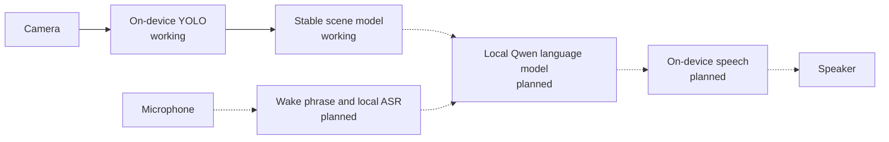

# POV Agent

POV Agent is a local-first Flutter experiment for an assistant that observes
through the camera, listens for a question, and answers using the current scene
as context.

> **Project status:** early prototype. Live and recorded camera input with
> on-device YOLO detection and stable scene tracking work today. The local
> language model, speech recognition, and spoken responses are still on the
> roadmap.

<p align="center">
  
</p>
<p align="center">
  <em>YOLO detection running in the iOS app through the recorded-video acceptance path.</em>
</p>

## Why

Most assistants only know what the user describes. POV Agent explores a more
direct interface: point the camera at a scene, ask a question aloud, and let the
agent respond without first translating the surroundings into a text prompt.

The MVP is designed to run on the device after its models have been installed.
Camera frames, audio, transcripts, and conversation history are not intended to
be persisted between launches.

## What works today

- Continuous object detection through the native camera surface.
- On-device `yolo26n` inference with bounding boxes, labels, confidence scores,
  FPS, and inference-time diagnostics.
- Front and rear camera switching, explicit camera enable/disable controls, and
  foreground lifecycle handling.
- Recoverable permission, model-loading, and inference failure states.
- Deterministic recorded-video input for testing the real iOS decoder and YOLO
  boundary without camera hardware.
- Session-scoped object tracking that suppresses isolated YOLO misses and emits
  only stable object appearance, movement, and disappearance.
- Unit, widget, and repository-boundary tests enforced by the checked-in
  Flutter Agentic Harness, plus explicit device integration lanes.

The Assistant tab is currently a placeholder. The repository does not yet
capture microphone audio, run a language model, or synthesize speech.

## Target interaction



Solid arrows represent the current implementation. Dashed arrows represent the
planned local agent loop.

## Roadmap

- [x] Live YOLO camera observation.
- [x] Stable scene state derived from noisy detections.
- [ ] Local Qwen language model and manual text conversation.
- [ ] Periodic scene-aware observations.
- [ ] System text-to-speech, followed by local Piper speech.
- [ ] Wake phrase and local streaming speech recognition.
- [ ] End-to-end hands-free question and answer flow.
- [ ] Long-running device, memory, and thermal validation.

The detailed acceptance criteria and model choices live in
[milestones.md](milestones.md).

## Platform scope

The current MVP target is iOS, with an iPhone 11 as the baseline physical
device. Live camera mode requires physical camera hardware. The recorded-video
acceptance path runs on an iOS Simulator.

Android parity, background observation, persistent memory, and barge-in are not
part of the current MVP.

## Getting started

Install Flutter with a Dart SDK compatible with `^3.12.0`, then fetch the pinned
dependencies:

```sh
flutter pub get
```

### Live camera

List the available devices and run on physical hardware:

```sh
flutter devices
flutter run -d <device-id>
```

### Recorded video

Recorded mode replaces the camera with the bundled `pedestrians.mp4` fixture:

```sh
cp .env.example .env
# Set USE_RECORDED_VIDEO=true in .env.
flutter run -d <simulator-id> --dart-define-from-file=.env
```

The iOS implementation reads the MP4 with `AVAssetReader`, encodes each selected
frame as JPEG, and passes it through the same single-image `YOLO.predict`
boundary covered by the repository tests. The decoder is pull-based: slow
inference skips timing opportunities instead of building an unbounded frame
queue.

Set `USE_RECORDED_VIDEO=false`, or omit the define, to restore live camera
input.

## Architecture

The application follows a feature-first clean architecture:

- `domain/` contains pure observation concepts and invariants.
- `application/` defines operations, lifecycle contracts, and platform ports.
- `data/` owns plugin adapters, native transport, mapping, and failure
  normalization.
- `presentation/` owns Bloc state, pages, and widgets.
- `app/` owns dependency composition, lifecycle startup, and navigation.

Flutter plugins and native DTOs stop at the data or app-composition boundary.
Presentation consumes application contracts and domain values rather than
calling camera or inference plugins directly. The complete contract is in the
[architecture overview](tool/flutter_agentic_harness/docs/architecture/overview.md).

## Verification

Run the deterministic changed-scope gate on any development machine:

```sh
dart run tool/harness.dart verify --changed
```

The recorded-video acceptance lane requires a booted iOS Simulator. It verifies
both native decoding and the full MP4-to-YOLO application journey:

```sh
flutter devices
tool/verify_recorded_ios.sh <simulator-id>
```

Live camera behavior must additionally be exercised on physical hardware.

## Privacy and offline behavior

- Camera inference runs on the device.
- The application does not intentionally save camera frames, recorded audio,
  transcripts, or conversation history.
- Camera and future audio runtimes are scoped to a foreground session.
- The current codebase contains no microphone or cloud-LLM transport.
- The pinned YOLO model is bundled for the deterministic iOS path; the runtime
  may use its download-and-cache fallback when a required model is unavailable.

Future agent milestones preserve this local and session-scoped data contract.

## Third-party assets

The bundled YOLO model and recorded fixture retain their upstream terms:

- [`yolo26n.mlpackage.zip`](assets/models/README.md) is distributed by
  Ultralytics under its applicable AGPL-3.0 terms.
- [`pedestrians.mp4`](assets/video/README.md) is derived from an OpenCV fixture
  distributed under Apache-2.0.

## License

A license has not yet been selected for the project source. Until a root
license is added, the source and the bundled third-party assets must be treated
under their respective existing terms.
