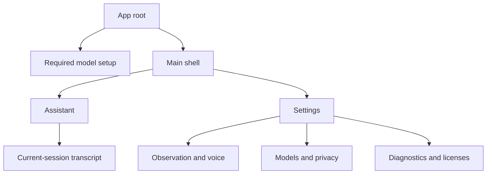

# Local AI Observer — Design Specification

- **Status:** Draft v0.2
- **Target:** Complete product after all implementation milestones
- **Product language:** English-first
- **Platforms:** iOS and Android (Material 3)
- **Related document:** `USER_FLOW.md`
- **Visual reference — iOS:** `images/local-ai-observer-ui-kit-ios.png`
- **Visual reference — Android:** `local-ai-observer-ui-kit-android.png`

This document is the implementation source of truth. The two UI-kit boards illustrate the platform systems; where a board and this specification differ, this specification takes precedence.

## 1. Purpose and scope

This specification describes the final, designed product that is applied after all planned runtime milestones are complete. It is not a milestone-by-milestone interface and must not expose temporary development shortcuts as final UX.

The product has one shared identity and two native presentations:

- **Shared product language** defines behavior, hierarchy, state, privacy, content, and semantic tokens.
- **iOS design system** maps that language to iOS navigation, typography, controls, motion, permissions, and accessibility.
- **Android design system** maps the same language to Material 3 components and Android system behavior.

Do not build one generic mobile UI and reskin it. A state such as `Listening` means the same thing on both platforms, but its navigation container, control feedback, modal presentation, and system recovery must follow the host platform.

## 2. Product model and non-negotiables

Local AI Observer is a private, on-device, object-aware AI observer. YOLO processes the live camera and passes stable object labels, approximate positions, and session-scoped IDs to Qwen. Qwen does not receive the raw image in this release.

The following constraints are product requirements:

1. A fresh install is blocked by required model setup until the complete pack is downloaded and verified.
2. Qwen downloads first; Vision, Voice, and Listening follow.
3. The main shell contains exactly two destinations: `Assistant` and `Settings`.
4. `Assistant` is the default destination after setup and on later launches.
5. Camera and microphone resources are active only while appropriate Assistant features are active.
6. Opening Settings or backgrounding the app pauses observation and releases camera/audio resources.
7. Prompts, detections, transcripts, responses, media, and settings are memory-only. Persistence is limited to verified model-pack artifacts, temporary model-transfer files, and minimal integrity/transfer metadata.
8. All first-release interface copy, wake behavior, ASR, Qwen prompting, and speech output are English.
9. The UI must describe the actual runtime honestly and never imply that Qwen sees the image directly.

## 3. Design intent

### 3.1 BeReal-inspired direction

The visual direction takes BeReal's camera-first directness as a reference:

- the live camera is the primary surface;
- chrome is sparse, high-contrast, and quickly understandable;
- controls use compact circles, pills, and overlays;
- the experience feels immediate, present, and unfiltered;
- the user reaches the core experience with minimal navigation.

This is inspiration, not a clone. Do not copy BeReal's logo, wordmark, proprietary assets, exact layouts, dual-camera composition, social feed, reactions, or posting mechanics.

| BeReal reference pattern | Product adaptation |
| --- | --- |
| Camera/photo dominates | Full-bleed live camera dominates `Assistant` |
| Dark, minimal camera chrome | Near-black shell with compact readable overlays |
| Overlapping secondary context | Assistant output card overlaps the scene |
| Short, direct state language | `Watching`, `Listening`, `Thinking`, `Speaking` |
| Immediate, unfiltered capture | Live scene has no filters, import, or staging |

Do not use a shutter, capture animation, red `REC` indicator, Memories metaphor, or simultaneous front/back frame. The app processes a live scene; it does not record or publish one.

Reference material:

- [BeReal official site](https://bereal.com/)
- [BeReal on the Apple App Store](https://apps.apple.com/us/app/bereal-photos-friends-daily/id1459645446)
- [BeReal on Google Play](https://play.google.com/store/apps/details?id=com.bereal.ft)

### 3.2 Product principles

#### Camera first

The current scene occupies most of the Assistant screen. Conversation and status sit over the camera instead of reducing it to a small preview.

#### Local and visibly private

The product makes its on-device behavior concrete:

- setup says models download once and inference stays on-device;
- Assistant always exposes an `On device` status;
- the transcript says `Clears when the app closes`;
- there are no accounts, cloud sync, galleries, memories, or saved-history metaphors.

#### Alive, not noisy

Watching, listening, thinking, and speaking must be understandable without showing a diagnostics console. Technical data remains available but secondary.

#### One obvious hierarchy

There are only three top-level surfaces: the model setup gate, Assistant, and Settings. Transcript, diagnostics, permissions, and recovery are inline, modal, or sheet presentations—not new destinations.

#### Honest capability

Copy may say `I can detect...` or `It looks like...`, but must not promise fine visual detail, color, text recognition, identity, or intent. Automatic comments must not infer identity, age, health, disability, emotion, ethnicity, or private circumstances from detected objects.

## 4. Shared information architecture and lifecycle

The shell is inaccessible until every required model is present and verified.

| Destination | Entry behavior | Resource behavior |
| --- | --- | --- |
| `Assistant` | Default. Starts or resumes observation once camera permission is available. | Owns camera, YOLO, observer timer, optional hands-free ASR, generation, and speech lifecycle. |
| `Settings` | Opens the platform-native settings presentation. | Pauses observation, cancels automatic work, and releases camera/audio. The in-memory transcript remains available for the process lifetime. |

If the user manually pauses Assistant, switching destinations does not override that decision. Returning to Assistant displays `Paused` until the user chooses `Resume`.

On backgrounding, cover the camera surface immediately, stop observation, stop or suspend speech/ASR, and release foreground-only camera and microphone resources. On foregrounding, return to the last destination. Observation may resume only on Assistant, with permissions available, and only if the user had not manually paused it.

## 5. Shared product design language

### 5.1 Visual character

The shared identity is dark, direct, compact, and camera-led. It uses monochrome structure with color reserved for operational meaning. Native platform affordances are visible; the product must not disguise Android as iOS or iOS as Material.

### 5.2 Semantic color tokens

These are semantic source tokens. iOS implements them in the asset catalog; Android maps them into the Material color scheme plus custom operational-state tokens.

| Token | Value | Use |
| --- | --- | --- |
| `color.background` | `#000000` | App canvas and camera letterboxing |
| `color.surface` | `#111111` | Cards, lists, navigation containers, modal surfaces |
| `color.surfaceRaised` | `#1B1B1B` | Selected rows and elevated controls |
| `color.overlayStrong` | `rgba(0,0,0,0.78)` | Camera overlays requiring maximum legibility |
| `color.overlaySoft` | `rgba(0,0,0,0.52)` | Secondary camera scrims |
| `color.textPrimary` | `#FFFFFF` | Primary text and icons |
| `color.textSecondary` | `#B8B8B8` | Helper and metadata text |
| `color.border` | `#343434` | Dividers and inactive outlines |
| `color.actionPrimary` | `#FFFFFF` | Primary controls |
| `color.onActionPrimary` | `#000000` | Content on a primary control |
| `color.success` | `#58E07B` | Ready, watching, verified |
| `color.listening` | `#70A7FF` | Wake detected and listening |
| `color.warning` | `#FFC857` | Thermal warning and recoverable degradation |
| `color.danger` | `#FF6666` | Critical failure and destructive action |

Rules:

- operational color is never the only state indicator;
- white is the primary action color on both platforms;
- detection boxes use white strokes and black labels by default;
- gradients are limited to subtle top and bottom camera scrims;
- all text over the live image receives a sufficiently opaque local scrim rather than relying on the frame for contrast.

### 5.3 Spacing and density

Shared spacing tokens are unitless: `4`, `8`, `12`, `16`, `24`, and `32`. Render them as points on iOS and density-independent pixels on Android. Do not share literal pixel values.

Common rules:

- outer content inset: `16`;
- compact gap: `8`;
- component gap: `12`;
- section gap: `24`;
- detection stroke: `2` logical units;
- minimum target: `44 × 44 pt` on iOS and `48 × 48 dp` on Android.

### 5.4 Shared state vocabulary

Use the same names, icons meanings, and announcements on both platforms:

| State | Meaning |
| --- | --- |
| `Watching` | Camera and detection are active; no user request is processing |
| `Listening` | Hands-free ASR is actively collecting a question |
| `Thinking` | Qwen is generating a response |
| `Speaking` | A completed or streaming response is being spoken |
| `Paused` | User paused Assistant; destination changes do not resume it |
| `Warning` | Feature is degraded but core interaction remains available |
| `Stopped` | Runtime released resources because of a blocking condition |

### 5.5 Shared component contracts

Component names describe behavior, not a cross-platform widget implementation.

| Contract | Required states |
| --- | --- |
| `ModelPackCard` | idle, downloading, verifying, ready, partial failure, corrupt |
| `ModelRow` | waiting, active progress, verified, failed |
| `StatusBadge` | watching, listening, thinking, speaking, paused, warning, stopped |
| `CameraStage` | permission needed, starting, live, paused, unavailable |
| `DetectionBox` | live native detection, updated, removed |
| `StableSceneSummary` | empty, building, populated, changed |
| `AssistantCard` | empty, waiting, streaming, complete, speaking, error |
| `QuestionComposer` | empty, ready, submitting, disabled |
| `CurrentSessionPresentation` | empty, populated, response playing |
| `InlineBanner` | info, warning, recoverable error, critical stop |
| `SettingsItem` | default, selected, disabled, needs attention |
| `MainNavigation` | Assistant selected, Settings selected |

Platform components may look different but must expose these same states and semantics.

### 5.6 Shared icon semantics

Define icons by meaning—Assistant/viewfinder, Settings, switch camera, pause, resume, sound, replay, close, lock, verified, warning—not by asset name. Use SF Symbols on iOS and Material Symbols on Android. Do not mix icon families or copy one platform's icon geometry onto the other.

### 5.7 Elevation and material

Prefer borders, opacity, and camera scrims over large shadows. Avoid large real-time blur areas because they cost GPU time and reduce legibility over a changing frame. Platform elevation may be used where it communicates native containment, but it must remain restrained.

## 6. Shared experience surfaces

### 6.1 Required model setup

Model setup is an app-root gate, not a dismissible modal or destination. The shell cannot be reached while any required model is missing, corrupt, or unverified.

| Friendly label | Runtime/model | Purpose |
| --- | --- | --- |
| `Assistant` | Qwen3-0.6B Q4_K_M | Comments and answers |
| `Vision` | YOLO26n | Live object detection |
| `Voice` | Piper | Offline speech output |
| `Listening` | Streaming ASR | Wake phrase and question recognition |

Qwen downloads first and is visually emphasized as the core assistant model. Vision, Voice, and Listening follow. The shell remains blocked until the complete pack is verified. File sizes and total transfer size come from the pinned model manifest. The 1.5 GB value is storage headroom, not the displayed download size or a RAM requirement.

Shared content order:

1. compact product mark or working name;
2. `Set up your on-device AI`;
3. `Download the required models once. After setup, the assistant works offline.`;
4. lock line: `Camera, audio, and conversations are not saved or uploaded.`;
5. four-row required-model card with Qwen highlighted;
6. download size and required available storage;
7. one primary action;
8. inline recovery when necessary.

The content may scroll on compact devices, but the action remains reachable above the safe/system inset.

| State | Presentation | Action |
| --- | --- | --- |
| Preflight | Storage and cached-file check | Disabled `Checking device...` |
| Ready | Model list and total size | `Download models` |
| Downloading | Overall progress, active file, downloaded/total bytes | Secondary `Cancel download` |
| Verifying | Completed transfers plus verification progress | Disabled `Verifying...` |
| Complete | Four verified checkmarks | Automatically enter Assistant |
| Offline before setup | Explicit network requirement; no indefinite spinner | `Try again` |
| Insufficient storage | Required and available capacity | Platform-specific recovery plus `Check again` |
| Download failure | Preserve successful verified rows | `Retry` |
| Checksum failure | Corrupt file never appears ready | `Download again` |

Closing and reopening returns to setup until the complete pack is verified. Verified files are never downloaded again. Canceling a transfer leaves setup blocked and preserves verified files; resumable partial data may be retained when supported by the downloader.

### 6.2 Assistant

#### Layout hierarchy

1. top status layer;
2. edge-to-edge camera stage;
3. detection and stable-scene layer;
4. latest Assistant output card;
5. manual text composer;
6. platform main navigation containing exactly Assistant and Settings.

The camera remains visible during normal observation. Opening the current session dims it behind the platform modal presentation rather than navigating to an opaque conversation destination.

#### Top status layer

Left:

- state badge: `Watching`, `Listening`, `Thinking`, `Speaking`, or `Paused`;
- secondary `On device` label;
- compact diagnostics: for example, `18 FPS · 42 ms`.

Right:

- switch camera;
- pause/resume.

Sound belongs to the Assistant card and Settings rather than competing with camera controls.

#### Camera and scene

- Preview fills the stage using one documented crop transform shared with bounding-box coordinates.
- Native detections use a 2-unit white outline and black `class · confidence` label.
- Native boxes may update at inference cadence; they are a live diagnostic view, not the scene sent directly to Qwen.
- The stable-scene summary shows items such as `person · left` and `laptop · center`.
- Only stabilized labels, session IDs, and 3×3 positions enter Qwen's prompt.
- Activating the summary opens an accessible list with class, session ID, and position.
- Do not apply beauty filters, simulated depth, or visual post-processing.

#### Assistant card

Content order:

1. state label, such as `ASSISTANT · THINKING`;
2. streaming or complete response;
3. session-relative timestamp when useful;
4. contextual actions: `Stop`, `Replay`, and sound on/off.

Reserve response space during streaming to limit layout movement. Use a caret or restrained text fade, not fake typing dots when real tokens are arriving. The preview displays the latest result; activating it opens the complete in-memory current session.

#### Manual composer

- Placeholder: `Ask about the detected scene...`
- Send activates only for non-whitespace input.
- Submission dismisses the keyboard and takes priority over automatic commentary.
- An active user request exposes `Stop` and blocks duplicate sends.
- Text input remains available without microphone permission.
- Typed answers are silent by default and expose `Play`.
- Automatic comments and voice-initiated answers use speech when sound is enabled.

#### Current session

The modal presentation contains only comments, questions, and answers from the current process lifetime. It is never named `History` or `Memories`.

Header:

- `Current session`;
- lock line: `Clears when the app closes`;
- platform-native dismiss control and gesture.

The transcript is read-only except for replaying completed Assistant responses. The sole composer stays on the underlying Assistant surface.

### 6.3 Voice-state presentation

| Runtime state | Visible treatment | Action |
| --- | --- | --- |
| Watching | Green indicator, icon, and `Watching` | Pause or type |
| Wake detected | Blue pulse and `I'm listening` | Cancel |
| Listening | Restrained waveform and live partial transcript | Cancel |
| Thinking | Assistant card streams when tokens arrive | Stop |
| Speaking | Audio activity and highlighted response | Stop speech |
| Silence timeout | `I didn't hear a question.` | `Try again` or type |
| ASR failure | Recoverable inline error | `Try again` |
| Microphone denied | No false listening state | Platform settings recovery or text |

Hands-free listening is off on every cold launch. The English wake phrase is `Assistant`. ASR is disabled during TTS. Do not imply spoken interruption or barge-in; it is outside this release.

### 6.4 Settings content

Settings uses a platform-native list, not a dashboard grid.

#### Observation

- `Comment interval`: `10 sec`, `30 sec`, `1 min`, `2 min`, `5 min`
- Helper: `Target cadence. Busy moments are skipped. Resets when the app closes.`
- Status: `Paused while Settings is open`

#### Audio and voice

- `Speak automatic and voice responses`
- `Hands-free listening`
- Wake phrase: `Say “Assistant”`
- Microphone permission state and platform recovery
- Offline system-voice fallback status

A system voice fallback is allowed only when the selected system voice is confirmed to work offline. Otherwise responses remain text-only.

#### Models

Each model shows its friendly role, technical name, installed size, and `Verified`, `Loading`, or `Needs attention`. Show `Verify again` or `Repair` only when relevant. Mandatory models cannot be disabled independently.

#### Privacy

- `Processing stays on this device.`
- `Photos, video, and audio are not saved.`
- `Conversations are not saved between app launches.`
- `Qwen receives detected object labels and approximate positions—not a photo.`
- `The camera and microphone stop outside the Assistant tab and in the background.`

#### Diagnostics and licenses

- current FPS and inference time;
- thermal state;
- model/runtime versions;
- third-party licenses for YOLO, Qwen, llama.cpp, Piper, and ASR dependencies;
- app version.

Diagnostic values should be selectable where practical but remain visually secondary.

All settings reset on cold launch. Persistent product data is limited to verified model-pack artifacts plus temporary transfer files and minimal integrity/transfer metadata needed to resume or validate setup.

### 6.5 Failure and degraded states

#### Memory warning

Replace the live camera with:

> Session stopped to free memory.
>
> Your current session is still available until the app closes.

Action: `Restart session`.

#### Thermal state: serious

Keep camera and manual questions available but stop automatic comments:

> Automatic comments are paused while your device cools down. You can still ask a question.

#### Thermal state: critical

Release AI, camera, and audio resources:

> Session stopped to cool down your device.

Enable restart only after the runtime reports a safe state.

#### Camera unavailable

Use a black placeholder, camera icon, specific explanation, and one recovery action. Never freeze the previous frame. Manual text remains available with `No camera context`; automatic observation remains off.

#### Generation failure

Keep the stable scene visible. Show `I couldn't finish that response.` with `Retry` for a user request. Failed automatic comments do not create a retry queue.

#### Audio interruption

Stop TTS and suspend ASR. Preserve completed text. Return to Watching after interruption and never resume speech unexpectedly.

### 6.6 Privacy presentation

- Cover the camera in the OS app switcher/Recents surface.
- Show in-app camera and microphone activity in addition to system indicators.
- Never imply background camera or microphone operation.
- Explain that hands-free mode processes microphone input locally while Assistant is active, including before wake detection.
- Do not add export, share, save, copy-image, or gallery actions to the camera.
- Do not persist thumbnails for crash reports or diagnostics.
- Do not log prompts, detections, transcripts, generated responses, or scene-bearing crash attachments.
- `On device` must reflect actual runtime behavior.

## 7. iOS design system

The iOS board is `images/local-ai-observer-ui-kit-ios.png`.

### 7.1 Foundation

#### Layout and units

- Use points and native safe-area insets.
- Default horizontal content inset: `16 pt`.
- Minimum interactive target: `44 × 44 pt`.
- Keep the camera edge-to-edge while all controls remain inside safe areas.
- Use a solid or near-opaque near-black navigation surface; do not use a large live blur over the camera.

#### Typography

Use the system typeface through semantic Dynamic Type styles. Values below are default-size design references, not fixed text sizes.

| Product role | iOS style | Reference metrics |
| --- | --- | --- |
| Setup hero | Large Title, bold | `34/41 pt` |
| Screen/modal title | Title 2, bold | `22/28 pt` |
| Section/Assistant emphasis | Headline, semibold | `17/22 pt` |
| Assistant response/body | Body, regular | `17/22 pt` |
| Control label | Subheadline, semibold | `15/20 pt` |
| Status/chip | Caption 1, semibold | `12/16 pt` |
| Metadata | Footnote, regular | `13/18 pt` |

Use tabular figures for progress, sizes, confidence, FPS, and inference time.

#### Shape and controls

- Compact overlay/control radius: `12 pt`.
- Assistant and model card radius: `16 pt`.
- Capsule status badges and circular icon controls are fully rounded.
- Let system sheets use the current native corner treatment.
- Use borders and opacity before adding shadow.

#### Icons

Use SF Symbols at approximately `22–24 pt`, matched by optical weight. Suggested destination semantics are `viewfinder` for Assistant and `gearshape` for Settings. Use filled variants only when they remain semantically and visually consistent. Every functional symbol has an accessibility label.

### 7.2 Navigation and presentation

#### Main navigation

- Use the standard bottom Tab Bar: `49 pt` content height plus bottom safe area.
- Show exactly Assistant and Settings, in that order.
- Keep labels visible in both selected and unselected states.
- Selected content is white; unselected content uses `color.textSecondary`.
- The bar uses a near-opaque `color.surface` background and is not a floating capsule.

#### Camera controls

Top overlay buttons are `44 × 44 pt` circles with native pressed/highlight feedback. They do not create a navigation bar over the camera.

#### Current session

Present the current session as a native sheet with medium and large detents, a drag indicator, and swipe-to-dismiss. Open at medium height; expanding content or the accessibility text sizes may promote it to large. Keep an explicit close control discoverable for VoiceOver. The sheet may be dismissed because it does not own a destructive or blocking operation.

#### Settings

Use an inset-grouped list with sentence-case section headings and explanatory footers. Use trailing native switches. Present Comment interval as a checkmarked selection list reached from a disclosure row; do not use an Android radio dialog or an overloaded five-item segmented control.

### 7.3 iOS component specifications

| Contract | iOS implementation |
| --- | --- |
| Primary action | White filled button, black label, `50 pt` height, `14 pt` radius, no all-caps text |
| Secondary action | Text or bordered button using white content |
| Icon action | `44 × 44 pt` circular control with native highlight |
| Status badge | Noninteractive capsule; icon plus label; minimum `28 pt` height |
| Model card | `16 pt` radius, `color.surface`, 1-pixel semantic border where needed |
| Progress | Native linear ProgressView; white progress on dark track |
| Toggle | Native iOS switch; label row remains a single accessible setting |
| Single choice | Checkmarked native list |
| Blocking confirmation | Native alert; action sheet only for an action choice anchored to the current context |
| Error/status feedback | Persistent inline banner for blocking state; native alert only when immediate acknowledgement is required |

### 7.4 iOS model download

- Setup is a full-screen root view with `16 pt` horizontal insets.
- Keep the `50 pt` primary action reachable above the bottom safe area.
- The design assumes resumable, background-capable transfers. Rehydrate exact per-file and overall progress when the app returns.
- iOS has no Android-style mandatory ongoing download notification. Do not create a fake persistent system surface. An optional completion notification may be offered later, but notification permission must not block setup.
- If the OS suspends visible progress, show the last confirmed byte count and resume reconciliation rather than resetting the bar.
- `Cancel download` is a secondary text action. Keep verified files and return to the ready/retry state.
- For insufficient storage, show required and available capacity plus `Check again`. Do not promise a direct deep link to iPhone Storage; it is not a supported recovery path. Plain instructions may tell the user to manage storage in Settings.

### 7.5 iOS permissions and system surfaces

1. Do not request camera or microphone during model setup.
2. On first Assistant entry, explain the need for the camera in product language, then trigger the native camera prompt from a clear continuation action.
3. Do not request microphone at the same time. Request it only when the user explicitly enables Hands-free listening.
4. If permission is denied, show a precise inline state. Use `Open Settings` only after the system prompt can no longer resolve the state directly.
5. Never imitate an iOS permission alert in custom UI.
6. Use an opaque privacy cover for app-switcher snapshots before the scene becomes inactive.

The manual composer remains fully available when microphone permission is absent. A camera denial leaves Assistant in the documented `No camera context` mode.

### 7.6 iOS motion and haptics

- Press/highlight response: native, approximately `100–150 ms`.
- Status and stable-scene cross-fade: `200 ms`, ease-in-out.
- Assistant-card container change: up to `250 ms`, ease-out.
- Sheet presentation and detent movement: native system spring; do not replace it with a cross-platform curve.
- Do not animate every detection callback. Animate only meaningful stable-scene changes.
- Listening may use a restrained waveform; no other decorative infinite animation.
- Respect Reduce Motion. Replace spatial transitions with fades where appropriate.
- Optional haptics: light impact on wake detection, success notification on full model verification, warning notification on critical stop. Haptics never carry meaning alone.

### 7.7 iOS accessibility

- Support Dynamic Type through all accessibility categories.
- At accessibility sizes, move dense metadata and the stable-scene detail into the large sheet rather than covering the composer or Tab Bar.
- Use VoiceOver groups for each detection summary, Assistant response, model row, and setting row.
- Do not expose every live bounding box as a separate constantly changing VoiceOver element. Expose one stable-scene list.
- Announce `Listening`, `Response ready`, permission failures, and critical stops. Do not announce every token or native detection update.
- Provide `accessibilityValue` for progress, verification state, switches, and operational status.
- Respect Bold Text, Increase Contrast, Differentiate Without Color, Reduce Motion, and Reduce Transparency.
- When Reduce Transparency is active, replace translucent overlays with opaque `color.surface`.
- Preserve a logical VoiceOver order from status to scene summary to response to composer to Tab Bar.

## 8. Android Material 3 design system

The Android board is `local-ai-observer-ui-kit-android.png`.

### 8.1 Foundation

#### Layout and units

- Use `dp` for layout and `sp` for text.
- Default horizontal content inset: `16 dp`.
- Minimum interactive target: `48 × 48 dp`.
- Draw edge-to-edge while applying display-cutout, status-bar, gesture-navigation, and IME insets.
- The camera may extend behind system bars only when icons maintain contrast through the documented scrims.

#### Material color mapping

Map shared colors into a dark Material 3 scheme:

| Material role | Shared token |
| --- | --- |
| `background` | `color.background` |
| `surface` | `color.surface` |
| `surfaceContainer` / `surfaceContainerHigh` | `color.surfaceRaised` |
| `onBackground` / `onSurface` | `color.textPrimary` |
| `onSurfaceVariant` | `color.textSecondary` |
| `outline` | `color.border` |
| `primary` | `color.actionPrimary` |
| `onPrimary` | `color.onActionPrimary` |
| `error` | `color.danger` |

Watching, listening, and warning remain dedicated semantic colors; do not force them into unrelated Material roles.

#### Typography

Use the platform system sans through Material 3 type roles. Values are scalable `sp` references, not fixed pixels.

| Product role | Material 3 role | Reference metrics |
| --- | --- | --- |
| Setup hero | Headline Large | `32/40 sp` |
| Screen/modal title | Headline Small | `24/32 sp` |
| Section emphasis | Title Medium, medium | `16/24 sp` |
| Assistant response/body | Body Large | `16/24 sp` |
| Control label | Label Large, medium | `14/20 sp` |
| Status/chip | Label Medium, medium | `12/16 sp` |
| Metadata | Body Small | `12/16 sp` |

Use tabular figures where the chosen platform typeface supports them; otherwise keep numeric columns fixed-width and right-aligned.

#### Shape and controls

- Compact overlay radius: `12 dp`.
- Assistant and model card radius: `16 dp`.
- Primary button radius: `24 dp` at `48 dp` height.
- Modal bottom-sheet top corners: `28 dp`.
- Status badges are fully rounded.
- Use Material state layers and restrained elevation rather than iOS-style borders on every group.

#### Icons

Use one Material Symbols family consistently, preferably Material Symbols Rounded, at `24 dp`. Suggested destination semantics are `center_focus_strong` for Assistant and `settings` for Settings. Selected icons may use the filled axis; inactive icons use the outlined treatment. Every functional icon has a content description unless its visible label already provides the accessible name.

### 8.2 Navigation and presentation

#### Main navigation

- Use Material 3 Navigation Bar at `80 dp` plus the bottom system inset.
- Show exactly Assistant and Settings, in that order, with two equal destinations.
- Keep labels always visible.
- Selected destination uses a `64 × 32 dp` active indicator.
- Use `color.surface` for the container, white selected content, and secondary unselected content.
- Do not reproduce the iOS Tab Bar, floating glass, or Cupertino selection treatment.

#### Camera controls

Top overlay controls are `48 × 48 dp` Material icon buttons with state-layer/ripple feedback. A status badge is noninteractive and must not be implemented as an Assist Chip merely because it has a capsule shape.

#### Current session

Use a Material 3 modal bottom sheet with a drag handle, scrim, `28 dp` top corners, and half-height/expanded behavior. System Back and predictive back dismiss it. At large font/display scales or compact height, open expanded or use a full-screen dialog presentation so content and dismissal remain reachable.

#### Settings

Use a Material preference-style list on the black surface:

- `56 dp` row minimum without supporting text;
- `72 dp` row minimum with supporting text;
- `16 dp` horizontal inset;
- sentence-case section labels;
- trailing Material switches;
- dividers only where grouping is otherwise unclear.

Present Comment interval in a Material single-choice radio dialog or modal bottom sheet. Do not copy the iOS disclosure/checkmark-list appearance.

### 8.3 Android component specifications

| Contract | Android Material 3 implementation |
| --- | --- |
| Primary action | White Material Filled Button, black label, `48 dp` height, `24 dp` radius |
| Secondary action | Text Button or Outlined Button according to hierarchy |
| Icon action | `48 × 48 dp` Icon Button with ripple/state layer |
| Status badge | Noninteractive capsule; icon plus label; minimum `32 dp` height |
| Model card | Material card, `16 dp` radius, tonal surface and restrained elevation |
| Progress | `4 dp` Linear Progress Indicator with semantic percentage |
| Toggle | Material 3 Switch; merge label and switch into one accessible setting action |
| Single choice | Radio list in Alert Dialog or modal bottom sheet |
| Blocking confirmation | Material Alert Dialog |
| Error/status feedback | Inline banner for persistent/blocking state; Snackbar only for transient, reversible feedback |

### 8.4 Android model download

- Setup is an edge-to-edge root screen with `16 dp` insets and a `48 dp` primary action.
- In-app model rows and progress are the source of truth while setup is visible.
- If download continues outside the foreground, mirror it in the platform-required ongoing notification. Use a `Model downloads` channel, title `Downloading on-device AI`, determinate overall progress when known, and a tap action that returns to setup.
- A notification cancel action may stop the transfer only if it has the same preserve-verified-files behavior as the in-app action.
- Notification permission must not become a new setup gate. If Android limits notification visibility, setup still restores exact progress when reopened and follows current foreground-service requirements.
- Restore transfer state after process recreation; do not restart a verified or completed model.
- For insufficient storage, show required and available capacity, `Open storage settings`, and `Check again`.

### 8.5 Android permissions and system surfaces

1. Do not request camera, microphone, or notification permission during model setup.
2. Request `CAMERA` on first Assistant entry after a short contextual explanation and clear user continuation.
3. Request `RECORD_AUDIO` only after the user enables Hands-free listening.
4. When Android indicates a rationale is appropriate, explain the blocked feature before retrying.
5. After a permission can no longer be resolved with the runtime prompt, show `Open app settings`.
6. Do not infer “permanently denied” from one denial, loop prompts, or imitate a system permission dialog.
7. Cover or suppress scene-bearing Recents thumbnails using the supported Android privacy mechanism.

The composer remains available without microphone permission. Camera denial uses the shared `No camera context` mode.

### 8.6 Android motion and haptics

- Press response uses the Material ripple/state layer.
- Small status and stable-scene transitions: `200 ms` with Material standard easing.
- Large container, sheet, and mode changes: `300 ms` with Material emphasized easing.
- Integrate modal dismissal with predictive back rather than playing an independent reverse animation.
- Do not animate every detection callback; animate meaningful stable-scene changes only.
- Listening may use a restrained waveform; no other decorative infinite animation.
- Respect the system animator-duration scale and remove spatial motion when animations are disabled.
- Optional haptics reinforce wake detection, full verification, and critical stop only when system vibration/haptic settings allow them.

### 8.7 Android accessibility

- Support TalkBack with a deliberate traversal order: status, stable scene, response, composer, Navigation Bar.
- Use `stateDescription` for operational status and switches; expose exact progress percentages and verification states.
- Merge a setting label, supporting text, and trailing switch into one accessible action to avoid duplicate focus targets.
- Do not expose each rapidly changing detection box. Expose the stable-scene list as the semantic representation.
- Announce `Listening`, `Response ready`, permission failures, and critical stops without announcing tokens or each detection.
- Support font scaling through at least `200%` and display scaling without clipping or overlapping the composer/navigation.
- At large scales, expand the current-session sheet and move diagnostics out of the camera overlay.
- Meet `48 × 48 dp` targets, preserve logical keyboard/switch-access focus, and respect high-contrast text where available.
- Respect disabled animations and remove motion without removing state changes.

## 9. Platform component decision matrix

| Need | iOS | Android |
| --- | --- | --- |
| Two primary destinations | Tab Bar | Material 3 Navigation Bar |
| Session detail | Detented system sheet | Material modal bottom sheet |
| Settings grouping | Inset-grouped list | Material preference/list items |
| Five-option interval | Disclosure to checkmarked list | Radio dialog or bottom sheet |
| Toggle | iOS switch | Material 3 Switch |
| Touch feedback | Native highlight | Ripple/state layer |
| Transient confirmation | Inline/native lightweight feedback | Snackbar |
| Destructive/blocking confirmation | Native alert/action sheet as appropriate | Material Alert Dialog |
| Background download surface | Restore in app; optional completion notification | Ongoing system notification when background transfer requires it |
| Insufficient-storage recovery | Instructions plus `Check again` | `Open storage settings` plus `Check again` |

This matrix is normative. Do not introduce a cross-platform component when a native platform component is named here.

## 10. Adaptive behavior

- Portrait phone layout is the primary acceptance layout.
- Camera preview and detection coordinates share one source of truth for scale and crop.
- On compact-height phones, collapse the Assistant card preview to two lines; activation opens the platform current-session presentation.
- The composer moves above the keyboard/IME and never hides the primary response action.
- On landscape phone layouts, camera occupies the left or upper majority while response and composer stay reachable. Do not stretch navigation labels into a desktop-style bar.
- iOS always respects safe areas, including Dynamic Island/notch and home indicator.
- Android always respects display cutouts, system bars, gesture navigation, keyboard insets, and window-size changes.
- On wider devices, constrain Settings content to a readable column. A tablet-specific information architecture is outside this release; do not add destinations.

## 11. English-first content requirement

The first complete release uses English consistently for:

- interface copy;
- Qwen prompts and outputs;
- wake phrase: `Assistant`;
- ASR language/model;
- primary Piper or verified-offline system TTS voice;
- accessibility labels, announcements, permission context, and download notifications.

The milestone plan currently names Russian TTS, Piper, ASR, and wake-phrase configurations. Replace or expand those runtime choices with English-compatible equivalents before this design is implemented. Mixing English responses with a Russian speech runtime is not an acceptable final state.

## 12. Acceptance checklist

### 12.1 Shared product acceptance

- [ ] A fresh install cannot bypass required model setup.
- [ ] The verified model pack includes Vision, Assistant, Voice, and Listening.
- [ ] Qwen downloads first; all four models verify before shell entry.
- [ ] The shell contains exactly Assistant and Settings.
- [ ] Assistant opens into a camera-first experience.
- [ ] Watching, Listening, Thinking, Speaking, Paused, Warning, and Stopped are distinguishable without color alone.
- [ ] Current stable scene, model state, streaming response, speech controls, and diagnostics are available without a developer overlay.
- [ ] Qwen receives stable object labels and approximate positions, not the raw image.
- [ ] Settings pauses observation and releases camera/audio.
- [ ] Backgrounding covers the preview and releases foreground-only resources.
- [ ] Manual pause survives destination changes.
- [ ] Typed answers are silent by default; automatic and voice-initiated answers follow the sound setting.
- [ ] Hands-free listening is off on every cold launch.
- [ ] No UI suggests accounts, cloud sync, saved media, or persistent history.
- [ ] Persistence is limited to verified model artifacts plus temporary model-transfer and integrity state; no user/session content persists.
- [ ] All copy, prompting, wake behavior, ASR, and TTS are English.
- [ ] Serious thermal, critical thermal, memory, permission, camera, audio-interruption, generation, and download failures match this specification.

### 12.2 iOS acceptance

- [ ] Navigation uses a native-proportioned Tab Bar with two labeled destinations.
- [ ] Current session uses iOS detents and native dismissal behavior.
- [ ] Settings uses inset-grouped lists, native switches, and a checkmarked interval list.
- [ ] Camera and microphone permissions are requested separately and at the moment of feature use.
- [ ] Insufficient storage does not offer an unsupported iPhone Storage deep link.
- [ ] Download progress reconciles correctly after backgrounding or process restoration.
- [ ] Dynamic Type, VoiceOver, Bold Text, Increase Contrast, Reduce Motion, and Reduce Transparency pass.
- [ ] Layout passes on iPhone 11 with accessibility text size and Reduce Motion enabled.

### 12.3 Android acceptance

- [ ] Navigation uses the Material 3 Navigation Bar with two labeled destinations and active indicator.
- [ ] Current session uses a Material modal bottom sheet and supports Back and predictive back.
- [ ] Settings uses Material list items, switches, and a radio-choice interval presentation.
- [ ] Camera and microphone runtime permissions are requested separately and at the moment of feature use.
- [ ] Background model download exposes the required ongoing system surface and restores exact progress.
- [ ] Storage recovery can open Android storage settings and recheck capacity.
- [ ] TalkBack, font scale at `200%`, display scaling, gesture navigation, and disabled animations pass.
- [ ] Camera, audio, thermal, memory, and 30-minute soak behavior are verified on a real arm64 Android phone, not only an emulator.

### 12.4 Cross-platform parity review

- [ ] Both platforms expose the same capabilities, state vocabulary, privacy promise, model gate, and content hierarchy.
- [ ] Each platform uses its own typography, navigation, modal, selection, feedback, motion, permission, and accessibility conventions.
- [ ] Neither implementation visually impersonates the other.
- [ ] Both UI-kit boards match this specification before implementation sign-off.
