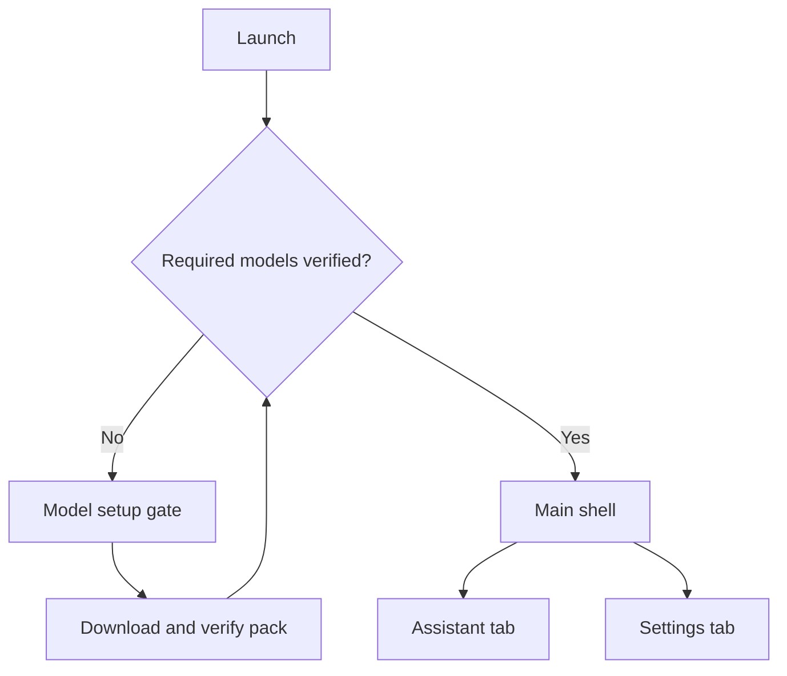
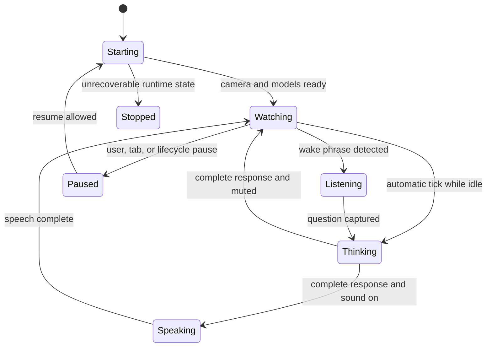

# Local AI Observer — User Flow

- **Status:** Draft v0.2
- **Target:** Complete MVP after all milestones
- **Product language:** English-first
- **Related document:** `DESIGN.md`

## 1. Fixed product decisions

This flow starts from the following decisions:

1. Model setup is mandatory. The app is unusable until the complete required model pack is downloaded and verified.
2. The completed MVP installs YOLO, Qwen, Piper, and streaming ASR through one setup gate.
3. After setup, the app has exactly two tabs: `Assistant` and `Settings`.
4. `Assistant` is the default tab and the core camera-first experience.
5. The product is English-first, including interface, generation, wake phrase, recognition, and speech.
6. Camera, microphone, inference, generation, and speech operate only while `Assistant` is active and interactive. Model transfer is the only background-capable operation.
7. User media, audio, prompts, conversations, and preferences are never written to persistent storage. Only model-pack artifacts, temporary transfer files, and minimal integrity metadata may remain on disk.
8. Qwen receives a structured stable-scene description from YOLO, not a raw camera image.

## 2. Recommended interaction decisions

These decisions make the two-tab structure behave coherently:

- Opening `Assistant` automatically starts observation after camera permission is available.
- Switching to `Settings` pauses observation and releases camera/audio resources.
- Returning to `Assistant` automatically resumes unless the user explicitly pressed `Pause`.
- A user question has priority over an automatic comment. It may cancel automatic generation or automatic speech, but it does not interrupt an answer to a previous user question.
- The session transcript stays in memory across tab switches, short background interruptions, and Android configuration changes. It disappears when the runtime session ends: on process death or force-quit, and on Android task removal even if the process briefly survives.
- Microphone denial does not block the app: live observation and typed questions remain available.
- Hands-free listening is off by default on every cold launch.
- Automatic comments and voice-initiated answers are spoken when sound is enabled. Typed answers remain silent unless the user taps `Play`.
- All preferences are runtime-session-scoped. Platform state restoration must not serialize them or any session content.

## 3. Top-level navigation

The model setup gate sits above navigation. It is not a dismissible modal, but system Home and Back actions may still leave the app. Deep links and relaunches resolve through model verification and never expose the shell early.

### 3.1 Platform navigation behavior

The shell has only two top-level destinations. Sheets and Settings detail pages are subordinate routes, not additional tabs.

| Context | iOS | Android |
| --- | --- | --- |
| Model setup root | No in-app dismissal or edge-swipe route into the shell; the Home gesture may leave the app | System or predictive Back uses back-to-home; it is never intercepted to enter the shell |
| `Assistant` root | No app-level Back action | System or predictive Back uses back-to-home |
| `Settings` root | Remains selected until the user chooses `Assistant` | Back returns to the start destination, `Assistant`; Back again uses back-to-home |
| Settings detail | Navigation-bar Back or edge swipe pops the detail | System or predictive Back pops the detail |
| Transcript sheet | Swipe down or explicit close dismisses it | System or predictive Back dismisses it |
| Keyboard open | Use normal iOS keyboard dismissal | Back closes the keyboard before dismissing a route or leaving the app |

Selecting a tab does not create duplicate destinations. Returning from `Settings` to `Assistant`, including through Android Back, follows the same permission checks and resume rules as a tab tap. Android setup and `Assistant` roots do not consume Back, so the platform predictive back-to-home animation remains available.

## 4. First-launch flow

### 4.1 Required model setup

| Step | User sees/does | App behavior | Failure branch |
| --- | --- | --- | --- |
| 1 | Opens the app and immediately sees `Set up your on-device AI`. | Reads the pinned model manifest and checks verified cache. | Manifest error shows a recoverable setup failure. |
| 2 | Reviews the required pack: Vision, Assistant/Qwen, Voice, and Listening. | Calculates download size and checks at least 1.5 GB free space. | Insufficient space shows required vs available space and `Check again`. |
| 3 | Taps `Download models`. | Starts the model download workflow. | No network shows `Connect once to download the models.` and `Try again`. |
| 4 | Watches overall and per-model progress. | Downloads Qwen first, followed by YOLO, Piper, and ASR. Only complete files may advance to verification. | A failed file gets `Retry`; verified files are retained. |
| 5 | Sees `Verifying...`. | Checks size and SHA-256 for every model. | A corrupt file is removed/ignored and offered as `Download again`. |
| 6 | Sees all four rows become `Verified`. | Marks setup ready and enters the main shell. | The shell remains inaccessible until every required row is verified. |

The default destination after setup is `Assistant`, not `Settings` and not a second onboarding carousel.

#### Background transfer and storage

After the user taps `Download models`, the transfer may continue while the app is backgrounded. Camera, microphone, inference, generation, ASR, and TTS never start as part of this work.

| Behavior | iOS | Android |
| --- | --- | --- |
| Long-running transfer | A background `URLSession` owns the download | Android 14+ uses a user-initiated data-transfer job; older supported versions use a long-running foreground `WorkManager` worker |
| System visibility | Progress is reconciled when setup returns to the foreground | Supply the required transfer notification/task entry; when exposed by the OS, tapping it opens setup and its cancel action stops unverified transfers |
| Permanent model location | `Library/Application Support`, excluded from device and iCloud backup | App-internal no-backup storage, such as `noBackupFilesDir` |
| Insufficient storage recovery | Explain how to manage device storage and offer `Check again`; do not use a private Settings URL | Open storage settings where a supported intent resolves, otherwise show instructions and `Check again` |

Completed files remain untrusted until size and SHA-256 verification succeeds. If the OS cannot finish verification in the background, setup continues with `Verifying...` on foreground return. The app never enters `Assistant` in the background.

`Cancel download` stops active unverified transfers, removes unsafe partial files, and retains already verified models. After any interruption, relaunch, notification cancellation, or system stop, setup reconciles the manifest, transfer state, and files before choosing the next action. Background transfer state never contains user content.

Android notification authorization is not a setup gate. If the user has disabled notification-drawer delivery, transfer status and cancellation remain available in setup and through any system task UI the OS provides.

### 4.2 Camera permission

Camera permission is requested only after model setup, when the user first reaches `Assistant`.

1. The Assistant surface explains: `Camera access lets the on-device assistant recognize objects around you. Frames stay on this device and are never saved.`
2. The user taps `Continue`.
3. The OS permission dialog opens.
4. If granted, the app starts the live camera, YOLO, scene stabilizer, and observer.
5. If unavailable, automatic observation remains off, but manual Qwen chat stays usable with a persistent `No camera context` label and the platform-appropriate recovery action.

Camera permission is required for the core Assistant experience.

The app never requests photo-library permission because it neither imports nor saves media.

| Authorization state | iOS | Android |
| --- | --- | --- |
| Not requested | Show the explanation, then the single system prompt | Show the explanation, then request `CAMERA` |
| Granted | Start through `Starting` | Start through `Starting`; an `Only this time` grant is treated as temporary |
| Denied | The app cannot prompt again; show `Open Settings` | If the system permits another request, show rationale and a user-triggered `Try again`; otherwise show `Open app settings` |
| Restricted or system-blocked | Explain that device policy prevents camera use; do not promise Settings can fix it | If permission is granted but the device privacy control blocks camera access, show a system-control recovery message |

Authorization is rechecked whenever the app becomes active and after returning from system Settings. System permission button labels are never reproduced in app copy because they vary by OS version, locale, and Android vendor.

### 4.3 Microphone permission

Microphone permission is just-in-time and non-blocking.

1. When hands-free listening is first enabled, the app explains: `The microphone is used only while Assistant is open. Audio is not saved.`
2. The user taps `Enable microphone`.
3. If granted, wake-phrase ASR starts when the Assistant reaches `Watching`.
4. If unavailable, `Hands-free listening` remains off, the Settings row shows the correct permission state, and typed questions continue to work.

On iOS, a denial cannot be prompted again: use `Open Settings`; a restricted state gets an explanation rather than a misleading recovery promise. On Android, an ordinary denial may offer rationale and a user-triggered `Try again`, while a blocked denial uses `Open app settings`. Android one-time grants and auto-reset permissions are rechecked on every resume. A granted permission with the device microphone privacy control disabled is treated as system-blocked, not as an ASR failure.

## 5. Returning-launch flow

| Startup condition | Result |
| --- | --- |
| All required cached models verify | Open the main shell on `Assistant`; no network is required. |
| One model is missing or corrupt | Open model setup with valid models preserved and the affected row marked `Needs download`. |
| No network, valid cache | Continue fully offline. |
| No network, incomplete setup | Remain at setup and explain that one initial connection is required. |
| Previous process or transfer job ended during download | Reconcile partial and complete files, retain verified files, and offer the correct remaining action. |

Do not show a generic splash spinner for more than the brief local verification period. If verification is taking time, show the setup screen with explicit progress.

Model readiness and permissions are reconciled independently. Valid models never imply current camera or microphone access. After verification, the app rechecks authorization before acquiring hardware; Android one-time and auto-reset grants may require another prompt. Returning from system Settings stays on the originating tab, refreshes its permission state, and resumes only when allowed.

A cold launch means creation of a new application process, not an Android Activity recreation. A new process starts with an empty transcript, default session preferences, and hands-free listening off. No iOS scene restoration, Android saved-instance state, `SavedStateHandle`, or Flutter restoration bucket may restore session content after process death.

## 6. Assistant entry and observation loop

### 6.1 Entry

When `Assistant` becomes active and interactive—an active iOS scene or the resumed Android Assistant destination:

1. Show `Starting...` over the camera stage.
2. Acquire the camera and start YOLO.
3. Load the Qwen runtime away from the UI isolate.
4. Start the scene stabilizer.
5. If hands-free is enabled and permitted, start streaming ASR in wake-phrase mode.
6. Enter `Watching` only when the camera and required observer components are ready.

The camera may become visible before every runtime is ready, but the status must remain `Starting...`; automatic comments do not begin early.

### 6.2 Stable scene

1. Raw detections arrive continuously.
2. An object enters the visible stable scene only after appearing in at least 3 of the last 5 frames.
3. Stable objects receive session-scoped IDs and 3×3 positions.
4. Native YOLO boxes continue to show live detections, while a separate stable-scene strip shows only the labels and positions that Qwen receives.
5. The scene state publishes only on a meaningful stable change.

Single-frame noise may appear in the native diagnostic boxes, but must not create stable-scene chip flicker, prompt changes, or transcript events.

### 6.3 Automatic comment loop

1. `Watching` starts the selected interval timer; default is 10 seconds.
2. The first automatic comment is triggered as soon as the first non-empty stable scene is available; regular ticks follow afterward.
3. On a tick, the observer checks whether generation or speech is already active and whether the stable scene is non-empty.
4. If busy or empty, the tick is discarded. It is never queued.
5. If eligible, the latest stable scene, previous comment, and last four dialogue pairs are sent to Qwen.
6. State changes to `Thinking`; real tokens stream into the Assistant card.
7. The first valid completed short sentence becomes the current comment.
8. If speech is on, state changes to `Speaking`, ASR pauses, and the app loads Piper only for playback.
9. Piper speaks the completed comment, then releases its runtime before wake-phrase ASR resumes.
10. When speech ends—or immediately when muted—the app returns to `Watching`. The selected interval is a target cadence; busy ticks are skipped and no exact countdown is promised.

Stopping observation cancels the timer and active automatic generation. There is no backlog of stale comments.

## 7. Typed-question flow

1. The user taps `Ask about the detected scene...`.
2. The keyboard opens while the live scene remains visible above it.
3. The user submits a non-empty question.
4. If an automatic comment is generating or speaking, that automatic activity stops and the user question takes priority.
5. The app sends the question with the latest stable scene and last four dialogue pairs.
6. State changes to `Thinking`; the response streams into the Assistant card.
7. The user may tap `Stop` to cancel generation.
8. On completion, the answer is added to the in-memory session transcript.
9. The typed answer remains silent. The user may tap `Play`; otherwise the app returns to `Watching`.

While answering a user question, duplicate sends are disabled. A second user request does not silently cancel the first.

### Typed-question failures

| Failure | UI behavior |
| --- | --- |
| Empty/whitespace input | Send remains disabled. |
| No stable objects yet | The question may still run with an explicit empty-scene context. |
| Generation fails | Preserve the question and show `I couldn't finish that response.` with `Retry`. |
| User cancels | Keep any already displayed partial text visually marked `Stopped`; do not add hidden reasoning to the transcript. |

## 8. Hands-free question flow

The English wake phrase is `Assistant`.

1. In `Watching`, streaming ASR listens locally for the normalized wake phrase.
2. ASR detects `Assistant` once and transitions to `Wake detected`.
3. The UI gives a light haptic and shows `I'm listening` with a live partial transcript.
4. The app collects the question after the wake phrase.
5. Listening ends after 1.2 seconds of silence or at the hard 15-second limit.
6. If a non-empty question exists, it is sent exactly once with the latest stable scene and last four dialogue pairs.
7. The UI enters `Thinking`, then `Speaking` when the final answer is ready.
8. ASR stays off for the entire TTS response so the assistant cannot hear itself; Piper is loaded for playback and released afterward.
9. After speech completes, the app returns to `Watching` and re-enables wake-phrase detection.

### Voice branches

| Condition | Result |
| --- | --- |
| Wake phrase only, then silence | `I didn't hear a question.` and return to `Watching`. |
| Empty normalized transcript | Do not call Qwen; return to `Watching`. |
| ASR error | Show `I couldn't hear that.` with `Try again`; typed input remains available. |
| Microphone permission revoked | Disable hands-free, show recovery in Settings, keep typed input. |
| Assistant is already speaking | ASR is off; barge-in is unavailable. `Stop` remains a visible touch action. |
| Automatic comment is active when a complete voice question arrives | Stop the automatic activity and prioritize the user question. |

## 9. Assistant controls

### Pause and resume

- `Pause` immediately stops the timer, current automatic work, camera, YOLO, ASR, and speech.
- The camera stage becomes a black `Paused` surface; it must not freeze the last frame.
- `Resume` reacquires resources and returns through `Starting` to `Watching`.
- A manual pause survives tab switches until the user explicitly resumes.

### Camera switch

1. User taps the camera-switch control.
2. State changes to `Starting...`.
3. The old camera session is released before the new one is acquired.
4. Stable scene and bounding boxes clear.
5. Automatic commenting resumes only after the new stable scene pipeline is ready.

### Sound

- Muting stops current speech and prevents future automatic playback.
- Muting does not stop camera observation or text generation.
- `Replay` plays only the selected completed response; it never queues multiple responses.

### Session transcript

1. User taps or swipes up the Assistant card.
2. `Current session` opens as a modal sheet.
3. The sheet shows comments, questions, and answers produced during the current runtime session.
4. User may replay a completed assistant response.
5. Dismissing the sheet returns to the unchanged Assistant state.

On iOS, swipe-down or the explicit close control dismisses the sheet. On Android, system or predictive Back dismisses it before navigating elsewhere. Sheet dismissal does not pause observation; switching tabs does.

## 10. Settings flow

Switching to `Settings`:

1. cancels the observer timer and every active generation, including a user answer;
2. stops TTS and ASR;
3. releases camera and YOLO resources;
4. preserves the in-memory transcript and the user's manual-pause flag;
5. shows `Paused while Settings is open`.

Any visible partial response canceled by the tab change remains marked `Stopped` and is not added as a completed dialogue turn.

Settings sections:

| Section | User actions | Persistence |
| --- | --- | --- |
| Observation | Select 10 sec, 30 sec, 1 min, 2 min, or 5 min interval | Current runtime session only |
| Audio and voice | Toggle spoken responses and hands-free listening; recover microphone permission | Current runtime session only |
| Models | Inspect size/version/status; verify or repair a failed model | Model files persist |
| Privacy | Read what is processed and what is not stored | No action required |
| Diagnostics | Inspect FPS, inference time, thermal state, versions, and licenses | No session data persisted |

Returning to `Assistant`:

- automatically resumes if observation was active before entering Settings;
- stays paused if the user had manually paused;
- rechecks permission and resource availability before showing `Watching`.

Settings detail destinations use a navigation push or native sheet on iOS and predictive-Back-compatible routes on Android. They remain under the `Settings` tab and never become additional top-level destinations.

Every Settings value is scoped to the runtime session and resets on a cold launch or Android task removal. Only model-pack artifacts and active model-transfer state persist.

## 11. Foreground and lifecycle flow

### 11.1 Shared lifecycle invariant

When the app stops being active and interactive:

1. immediately replace the camera preview with a privacy cover before an app-switcher snapshot can expose a frame;
2. cancel the observer timer and active generation;
3. stop TTS and ASR;
4. release camera, YOLO, and other Assistant runtime resources at the platform's release boundary;
5. retain only allowed in-memory session state while the runtime session survives.

Model transfer may continue under Section 4.1 and owns no camera, microphone, inference, generation, or conversation state.

On active return:

- recheck camera and microphone authorization before acquiring either resource;
- if `Assistant` was active and the user had not manually paused, reacquire through `Starting`;
- if `Settings` was active, remain in Settings with observation paused;
- remove the privacy cover only after the preview is safe to display;
- if a new process was created, start an empty session after verifying cached models.

### 11.2 iOS lifecycle

- When the scene resigns active, apply the privacy cover and quiesce Assistant work immediately.
- By scene background entry, camera, microphone, TTS, ASR, observer, and inference resources are fully released.
- When the scene becomes active, reconcile permissions and follow the shared return flow.
- A system permission panel is a transient lifecycle interruption; it never clears the transcript by itself.
- The process may be terminated without another callback. Scene-state restoration must not contain transcript, composer, stable-scene, dialogue, or preference data.

### 11.3 Android lifecycle

- On loss of the resumed Assistant state, apply the recents privacy cover and stop sensitive capture/audio immediately.
- By `onStop`, every Assistant resource and active generation is released or canceled.
- On `onResume`, reconcile normal, one-time, auto-reset, and system privacy-control permission states before following the shared return flow.
- A configuration change may rebind the UI to the same in-memory runtime session; it does not clear the transcript or count as a cold launch. Session content must not enter saved-instance state or `SavedStateHandle`.
- In multi-window, only the currently resumed Assistant instance may own camera and microphone resources. Another visible instance shows `Assistant is active in another window.`
- Android may kill the process without `onDestroy` or a memory callback. Removing the app task explicitly ends the runtime session and clears its in-memory content.
- The implementation must suppress the recents camera snapshot. If the chosen fallback is `FLAG_SECURE`, document that it also disables user screenshots; otherwise use a recents-only mechanism where the supported API level permits it.

### 11.4 Incoming call or audio interruption

1. Stop speech and suspend ASR.
2. Preserve completed response text.
3. Do not auto-resume interrupted speech.
4. Restart ASR and return to `Watching` only after audio focus is restored, the app is active, `Assistant` is selected, permission remains granted, and the user is not manually paused.

iOS uses the audio-session interruption route; Android uses audio-focus changes. If the call or interruption also backgrounds the app, the full lifecycle shutdown takes priority.

## 12. Resource-protection flows

Native signals map into product states; the UI does not expose raw platform terminology.

| Product state | iOS source | Android source |
| --- | --- | --- |
| Recoverable memory pressure | UIKit memory warning | A delivered `onTrimMemory` or equivalent low-memory signal |
| Degraded thermal | `serious` thermal state | `SEVERE` or the equivalent configured threshold |
| Critical thermal stop | `critical` thermal state | `CRITICAL`, `EMERGENCY`, or `SHUTDOWN` |

If a platform cannot report a signal, diagnostics shows `Unavailable`; it never fabricates a safe state. Android process death can occur without a warning, in which case no stop screen is possible and the next process starts a new empty session.

### Recoverable memory pressure

1. Stop the session.
2. Cancel generation and release camera, model, timer, subscription, and audio resources.
3. Show `Session stopped to free memory.`
4. Offer `Restart session`.
5. Restart only after the user acts; do not enter an automatic crash loop.

### Degraded thermal

1. Stop automatic comments and speech.
2. Keep the camera and typed question path available.
3. Show a persistent warning that manual questions still work.
4. Resume automatic comments only after the device returns to an acceptable thermal state.

### Critical thermal stop

1. Stop the complete AI session and release all resources.
2. Replace the camera with `Session stopped to cool down your device.`
3. Disable restart until the runtime reports a safe state.
4. Let the user explicitly restart.

## 13. Error and recovery matrix

| Failure | Blocking scope | Recovery |
| --- | --- | --- |
| Initial network unavailable | Entire app before first setup | Connect and `Try again` |
| Insufficient storage | Entire app before setup | Free space and `Check again` |
| Unsupported device or ABI | Entire app during preflight | Explain the minimum requirement; do not enter a restart loop |
| Download failure | Affected required model; shell remains blocked | `Retry` failed item |
| Checksum failure | Affected required model; shell remains blocked | `Download again` |
| Camera permission unavailable | Automatic observation | iOS denial uses `Open Settings`; recoverable Android denial uses `Try again`, blocked denial uses app settings; manual chat keeps `No camera context` |
| Camera unavailable/in use | Current Assistant session | `Try again` after releasing conflict |
| YOLO failure | Scene-aware features | Restart vision; manual chat remains available without scene context |
| Qwen load/generation failure | Comments and answers | `Retry` user request or `Restart session` |
| TTS failure | Speech only | Keep text, expose `Replay`, use system fallback when available |
| Microphone permission unavailable | Hands-free only | Use the platform recovery branch or type; never block the camera or composer |
| ASR silence/empty result | Current voice request only | Return to Watching and try again |
| ASR runtime failure | Hands-free only | `Try again`; typed input remains |
| Recoverable memory pressure | Current session | Explicit `Restart session` |
| Degraded thermal | Automatic comments | Wait; manual question remains |
| Critical thermal stop | Entire session | Wait for safe state, then restart |
| Network loss after setup | Nothing | Continue offline without an error banner |

Every error says what stopped, what still works, and what the user can do next.

The system TTS fallback may be used only after confirming that the selected English voice operates offline. Otherwise the safe fallback is text-only.

A repeated memory-load failure is treated as device incompatibility. The app must not silently downgrade Qwen, change quantization, or loop through automatic restarts.

## 14. Interaction priority

When actions collide, use this order:

1. thermal, memory, permission, and lifecycle shutdown;
2. explicit `Stop`, `Pause`, camera switch, or tab change;
3. a user-initiated typed or voice question;
4. an automatic observation tick.

Camera switching cancels any in-flight scene-dependent turn, clears the stable scene and tracking IDs, and restarts stabilization. Cancelled, failed, or empty voice turns are not added to dialogue context.

## 15. Session and data boundaries

| Data | In memory | On disk | Cleared when |
| --- | --- | --- | --- |
| Current stable scene | Yes | Never | Pause, camera switch, tab/lifecycle suspension, or runtime-session end |
| Current transcript | Yes | Never | Runtime-session end |
| Raw camera frames | Runtime only | Never | Immediately after processing |
| Raw/streaming audio | Runtime only | Never | Immediately after recognition window |
| Dialogue context | Last four pairs in memory | Never | Runtime-session end |
| Verified model artifacts | Loaded as needed | Yes, in platform no-backup app storage | Explicit future storage management or uninstall |
| Partial model transfer and integrity metadata | As needed | Yes, in model-transfer storage only | Verification, cancel cleanup, replacement, or uninstall |
| Interval and audio choices | Yes | No | Runtime-session end |

On iOS, verified models live in `Library/Application Support` with backup exclusion; on Android, they live in app-internal no-backup storage. Uninstall removes the complete pack on both platforms. Downloadable models must not enter iCloud, device-transfer backup, or Android Auto Backup.

No flow may introduce a hidden media cache, transcript database, analytics upload, crash attachment containing scene data, iOS scene-restoration payload, Android saved-state payload, or Flutter restoration payload containing session content. Navigation after a new process always starts from verification and then `Assistant`, regardless of any platform-restored route.

## 16. Key acceptance scenarios

### Scenario A — Fresh install to first comment

1. Launch app.
2. Download and verify the complete model pack.
3. Enter `Assistant`.
4. Grant camera permission.
5. See `Starting`, then `Watching` and stable detections.
6. See the first streaming comment as soon as the first non-empty stable scene is ready.
7. Hear the completed comment when sound is enabled; later comments follow the selected cadence.

### Scenario B — Fully offline returning launch

1. Disable network after successful setup.
2. Relaunch app.
3. Cached models verify.
4. Assistant observes, comments, listens, answers, and speaks without network access.

### Scenario C — Typed question wins over automation

1. Let an automatic comment begin.
2. Submit a typed question.
3. Automatic work stops without entering the transcript as a completed response.
4. The user answer streams once with the latest scene context.

### Scenario D — Hands-free question

1. Say `Assistant` while Watching.
2. See and hear the listening acknowledgement.
3. Ask a question and stop speaking.
4. The app submits once after 1.2 seconds of silence.
5. ASR stays off while the answer is spoken.

### Scenario E — Settings owns no camera session

1. Switch from Assistant to Settings.
2. Confirm camera and microphone activity stop.
3. Change interval.
4. Return to Assistant.
5. Observation resumes with the new interval and the in-memory transcript intact.

### Scenario F — Privacy and lifecycle

1. Background the app during observation.
2. Confirm the app switcher shows no camera frame.
3. Confirm camera/audio resources are released.
4. Return and observe a clean restart through `Starting`.
5. Kill and relaunch into a new process; confirm the previous transcript is gone and verified models remain.

### Scenario G — Platform background model transfer

1. Start the required model download and background the app.
2. On iOS, confirm the background transfer can progress without any Assistant runtime; on Android, confirm the user-visible transfer notification and cancel action.
3. Return through the setup gate and reconcile real file progress.
4. Verify every file before the shell opens; never enter `Assistant` from a background callback.

### Scenario H — iOS permission recovery

1. Deny camera access and confirm the app does not issue a second system prompt.
2. Continue to use typed no-context chat.
3. Open app Settings, grant camera access, and return.
4. Confirm authorization is rechecked and observation starts through `Starting`.
5. Test the restricted state separately and confirm the copy does not promise a user-fixable setting.

### Scenario I — Android permission variants

1. Test camera and microphone with ordinary denial, blocked denial, `Only this time`, auto-reset, and the device privacy control disabled.
2. Confirm only a recoverable denial offers `Try again`; blocked access opens app settings.
3. Background and resume after a one-time grant.
4. Confirm permission is rechecked before camera or ASR restarts and typed input always remains available.

### Scenario J — Android Back and restoration

1. Confirm Back closes the keyboard, transcript sheet, and Settings detail before changing a top-level destination.
2. From Settings root, use predictive Back and return to `Assistant`; from Assistant root, confirm predictive back-to-home.
3. At setup root, confirm Back goes home and never bypasses verification.
4. Rotate or recreate the Activity and confirm the in-memory transcript survives without entering saved state.
5. Remove the task or kill the process, relaunch, and confirm transcript, selected route, and preferences reset while verified models remain.

### Scenario K — Platform pressure mapping

1. Inject each supported native memory and thermal signal.
2. Confirm it maps to the documented product state and recovery flow.
3. On Android, also test process death without a warning and confirm the next process starts an empty session without claiming that a stop screen was shown.

## 17. Engineering alignment required before design implementation

The existing milestone plan specifies Russian system TTS, a Russian Piper voice, Russian streaming ASR, and the wake phrase `Ассистент`. This final user flow is explicitly English-first. Before implementing the design, engineering must select and pin English-compatible TTS/Piper and ASR assets and use the wake phrase `Assistant`, while preserving the same ports, lifecycle, storage checks, and offline guarantees.
